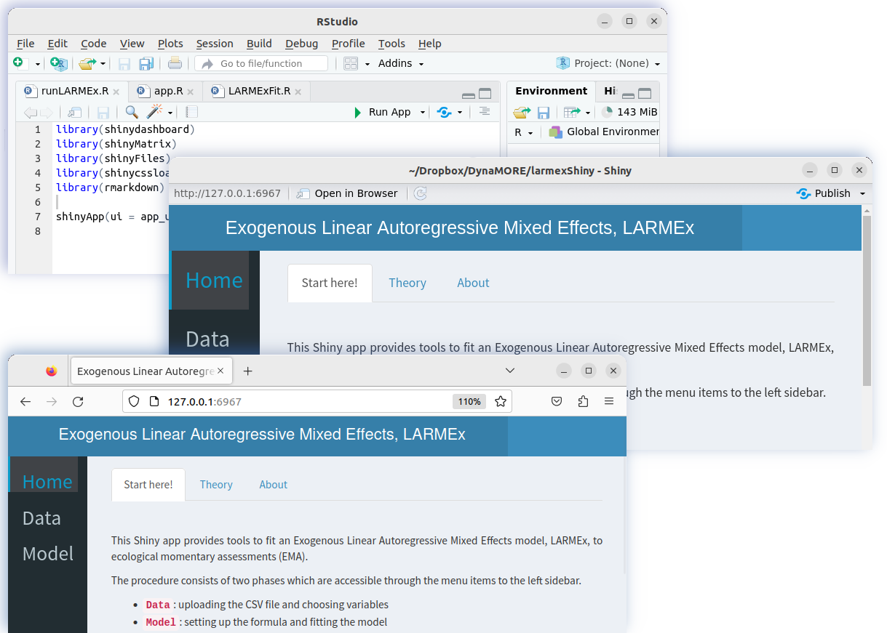

# Intraindividual Dynamic Network of Affects

This repository hosts R code for a Shiny application developed as part of [DynaMORE](http://www.dynamore-project.eu) projct. It provides tools to fit an **Exogenous Linear Autoregressive Mixed Effects model**, LARMEx, to ecological momentary assessments (EMA).

## How to use the app?

-   install **R** from [r-project](https://www.r-project.org/)
-   install **RStudio** from [rstudio-desktop](https://posit.co/download/rstudio-desktop/)

### I. Install as an R package

-   to install packages from GitHub one needs the R package "remotes"
    -   **`install.packages("remotes")`**
-   install "larmexShiny""
    -   **`remotes::install_github(repo = "spooseh/larmexShiny", ref = "master", dependencies = TRUE)`**
-   load the package
    -   **`library(larmexShiny)`**
-   run in command line
    -   **`runLARMEx()`**

### II. Download the source code and run locally

- two ways to get the codes:
    - i.  through terminal by **cloning** or download the repository
        *   **`git clone -b clone_and_run --single-branch https://github.com/spooseh/larmexShiny.git`**
    - ii. **downloading** the repository through a browser
        *   go to [github.com/spooseh/larmexShiny](https://github.com/spooseh/larmexShiny.git)
        *   select the branch "clone_and_run"
        *   download the code as a zip file ("larmexShiny-clone_and_run.zip")

-   navigate to the local directory, **`larmexShiny`**, in RStudio

-   optional: for a smooth work flow, make this folder, by `setwd()`, the working directory

-   open **`packInstaller.R`** and press **`Source`** in RStudio

    -   it runs the command `source("packInstaller.R")`
    -   one could install the missing packages manually
    -   see `sessionInfo.txt` for version information

-   open the **`runLARMEx.R`** file and click the **`Run App`** at the top of your editor's menu

## What you see

-   an Rstudio window opens and shows the user interface
-   you can click **`Open in Browser`** or enter the address next to it, **`http://127.0.0.1:6967`**, on a browser of your choice (6967 may be different in your case)

 

### Instructions

-   detailed instructions in [larmexShiny/www/Instructions.md](https://github.com/spooseh/larmexShiny/www/Instructions.md)

### Not interested in a GUI?

-   follow the R commands in [larmexShiny/www/demo.Rmd](larmexShiny/data/demo.R)

### To do ...

-   exception handling
-   more documentation

<a rel="license" href="http://creativecommons.org/licenses/by/4.0/"> </img></a>
