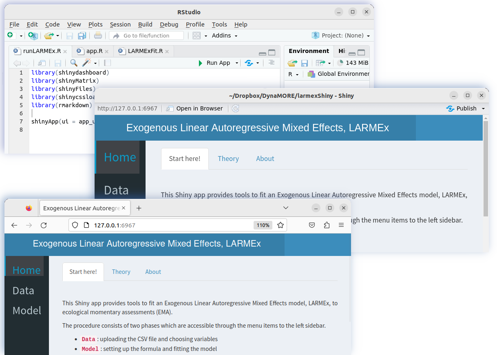

# Intraindividual Dynamic Network of Affects
This repository hosts R code for a Shiny application developed as part of 
[DynaMORE](http://www.dynamore-project.eu) projct. It provides tools to fit an 
**Exogenous Linear Autoregressive Mixed Effects model**, LARMEx, to ecological 
momentary assessments (EMA). 

## How to use the app?
- install **R** from [r-project](https://www.r-project.org/)
    * install **RStudio** from [rstudio-desktop](https://posit.co/download/rstudio-desktop/)
    * see `sessionInfo.txt` for version information 
- clone or download the repository
    * **`git clone https://github.com/spooseh/larmexShiny.git`**
### Run the app locally
- navigate to the local directory, **`larmexShiny`**, in RStudio
- optional: for a smooth work flow, make this folder, by `setwd()`, the working directory 
- open **`packInstaller.R`** and press **`Source`** in RStudio
    * it run the command `source("packInstaller.R")` 
    * install the missing packages manually
    * see `sessionInfo.txt` for version information 
- open the **`runLARMEx.R`** file and click the **`Run App`** at the top of your editor's menu
    * an Rstudio window opens and shows the user interface
    * you can click **`Open in Browser`** or enter the address next to it, **`http://127.0.0.1:6967`**, on a browser of your choice (6967 may be different in your case)

 

### Instructions

- detailed instructions in [larmexShiny/www/Instructions.md](https://github.com/spooseh/larmexShiny/www/Instructions.md)

### Not interested in a GUI?
- follow the R commands in [larmexShiny/data/demo.R](larmexShiny/data/demo.R)

### To do ...
- a production-grade Shiny applications to be installed as an R package
 

<a rel="license" href="http://creativecommons.org/licenses/by/4.0/">
</img></a>
