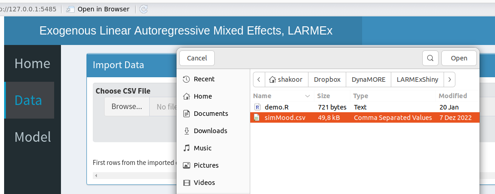
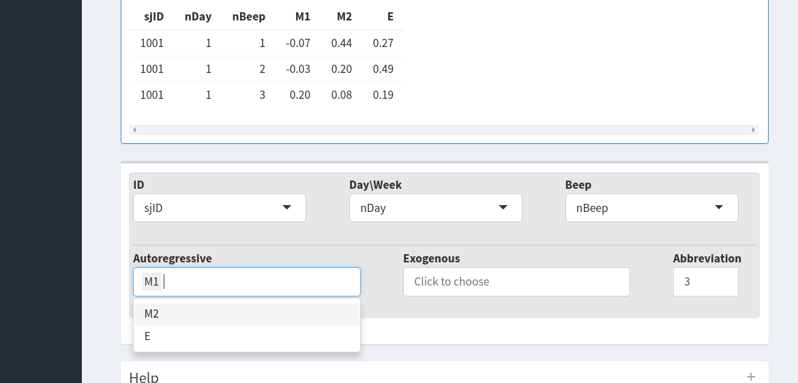
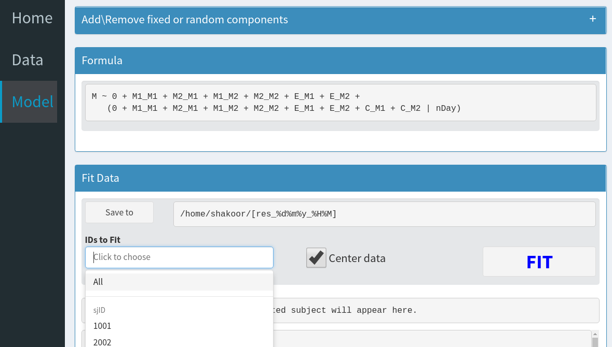
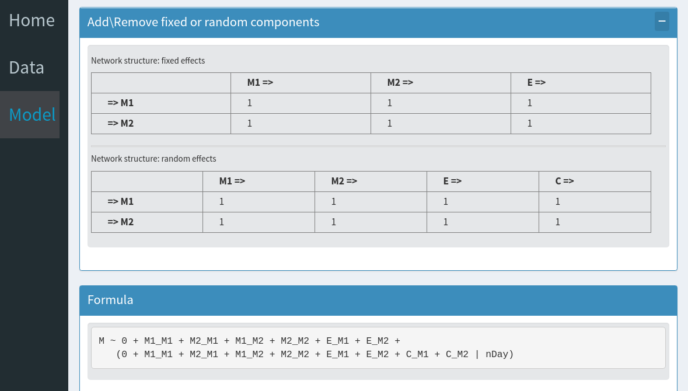
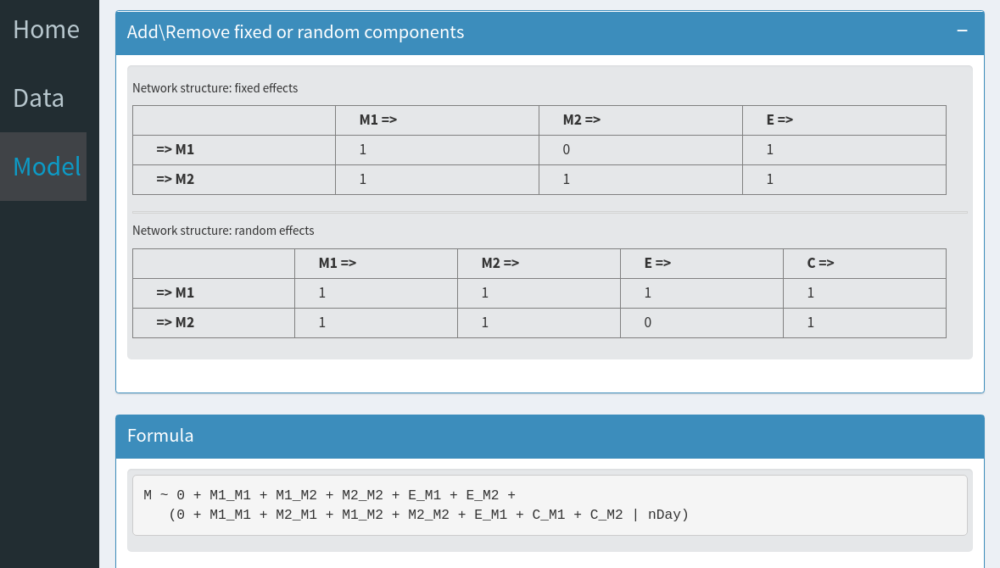

---
output:
  html_document:
runtime: shiny
---
  
This interactive Shiny app serves as a platform for fitting an Exogenous Linear 
Autoregressive Mixed Effects model, known as LARMEx, to ecological momentary 
assessments (EMA).

To ensure a seamless user experience, it is strongly recommended to follow the 
menu sequentially from top to bottom. Should you wish to make substantial 
alterations, kindly refresh the application and commence anew.

The process encompasses two distinct phases, both of which can be accessed 
through the menu items located in the left sidebar:
- **`Data`**: Uploading a CSV file and selecting the variables of interest 
- **`Model`**: Setting up the formula and fitting the model 

Beneath each panel, you will find a **Help** section that offers guidance. 
You can view the instructions by expanding this section using the **+** sign.

*Sidebar Not Visible*: 
If you are unable to view the sidebar menu with a black background on the left, 
kindly adjust the browser's window width.

### Instructions

#### Import data
- To begin, navigate to the **Data** menu item located on the sidebar, then 
proceed to upload your data in **CSV** format. The assumption is that the CSV 
file contains the following columns: 
    * **`ID`**:  Represents the subject's ID for extracting data pertaining to 
    an individual respondent.
    * **`nDay`**:  Serves as a level 2 variable within a multilevel setup, 
    indicating attributes like the number of days or weeks.
    * **`nBeep`**:  Designates a level 1 variable within a multilevel structure, 
    signifying the count of beeps for EMA data.
    * **`Autoregressive`**:  Encompasses columns related to interactive moods, 
    such as M1 and M2, as illustrated below.
    * **`Exogenous`**:  Encompasses columns corresponding to external factors, 
    for instance, E.

#### Indicate Variable Names
- Select the variable names from the provided drop-down menus.
    * In case the selected variables, namely **ID**, **nDay**, and **nBeep**, 
    do not adhere to the multilevel format, conflicting columns will be cleared 
    after an error notification emerges. This notification will pinpoint a 
    potential source of the issue.
    * Optionally, you can stipulate whether an **Abbreviation** should be made 
    on the names of moods and external factors.

#### Define the Model and Initiate Fitting
- Within the **Model** panel, a mixed effects formula is presented under 
**Formula**. This comprehensive model assumes fixed- and random-effects 
components for each **Autoregressive** and **Exogenous** variable.
    * If necessary, you have the freedom to modify this formula using the 
    instructions provided under **Add\Remove fixed and random components** as 
    detailed below.
    * The results will be stored in your personal home directory, within a new
    directory named as **larmex_DATE_TIME**. DATE and TIME correspond to the values 
    of your local setting during the moment you click on the FIT button.
    * If needed, you can modify the main directory of the results folder using 
    the **Save to** option.
    * Under **IDs to Fit**, you are presented with the choice of selecting 
    **All**, a single ID, or multiple IDs. This determines whether the model 
    fitting applies to the complete dataset or specific segments based on the 
    chosen IDs.
    * When the **Center data** option is selected, observations are centered 
    for each individual respondent.
    * Once you click the FIT button, the duration for generating results may 
    vary depending on the volume of data being processed. 

    * Inside larmex_DATE_TIME, you'll find the following files:
      - **fe_SbjID.csv**: This file holds the estimates for the fixed effects.
      - **re_SbjID.csv**: Here, you'll find the estimates associated with the 
      random effects.
      - **sbj_SbjID.RData**: This file contains a "LARMExFit" R6 object.
      - **summary_SbjID.txt**: This file encompasses the summary of the fitting 
      process captured by lme4, the output of `lm4::summary()`.
      

#### Adjusting the Model Configuration
- The construction of the model formula relies on adjacency matrices for both 
fixed and random effects.

- Each term within the formula corresponds to an edge within the network, 
connecting a column to a row.
    * For instance, **M2_M1** denotes the link from **M2** to **M1**, aligning 
    with the cell that intersects column **M2 =>** and row **=> M**.
- The presence or absence of each term is represented by **1** or **0**, 
respectively. 
- Modifying the model involves adding or removing terms by altering the 
corresponding cell values to one or zero, as needed.
- Access to fixed and random effects is facilitated through the upper and lower 
matrices, respectively.
- To eliminate, for instance, the effect of **M2_M1** from the fixed-effects 
and **E_M2** from the random-effects:
    * It may be necessary to click outside the cell to ensure the change takes 
    effect.
    

