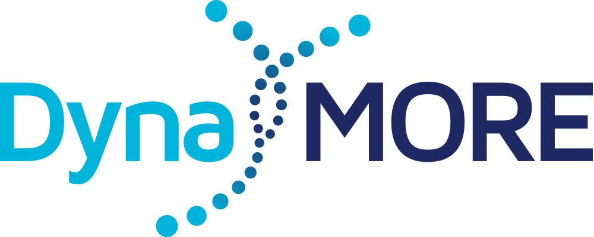
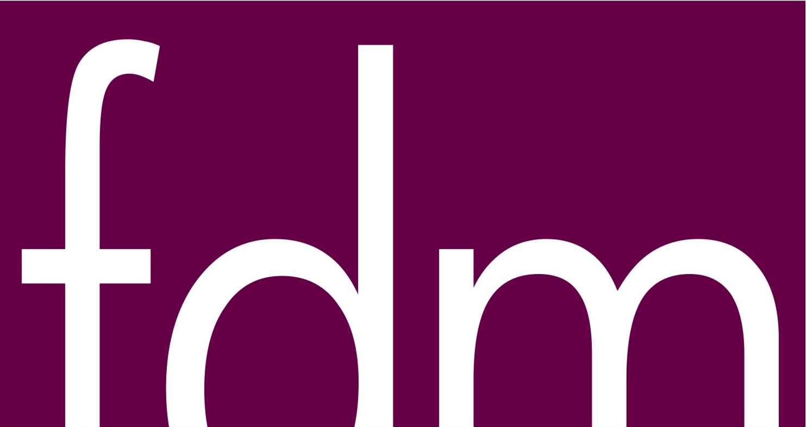
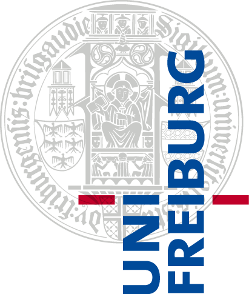
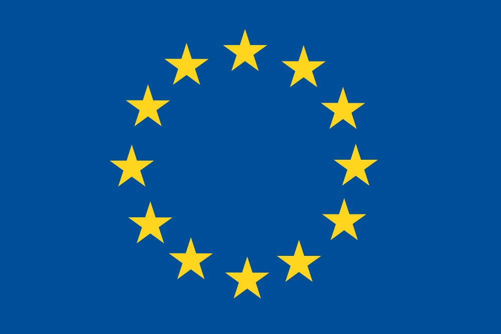

---
output:
  html_document:
runtime: shiny
---
### OUR VISION
We are a multidisciplinary team of researchers with the joint goal of 
developing an in-silico model of stress **resilience**. To do so, we monitor 
healthy at-risk individuals (18+ years old) during stressful life phases, 
such as transition into adulthood or higher education, training-to-street 
transition (police officers), or abruptly changed life situations 
(accident victims in recovery). 
[Read more ...](https://dynamore-project.eu/about/our-vision/)

### CONTACT
For inquiries about this tool please contact:  

  Shakoor.Pooseh[AT]fdm.uni-freiburg.de

### FUNDING
This project has received funding from the European Union's Horizon 2020 
research and innovation programme under grant agreement No 777084.

<table style="border: 0px solid">
  <tr>
    <td class="bordered">
      
    </td>
    <td class="bordered">
      
    </td>
    <td class="bordered">
      
    </td>
    <td class="bordered">
      
    </td>
  </tr>
</table>

